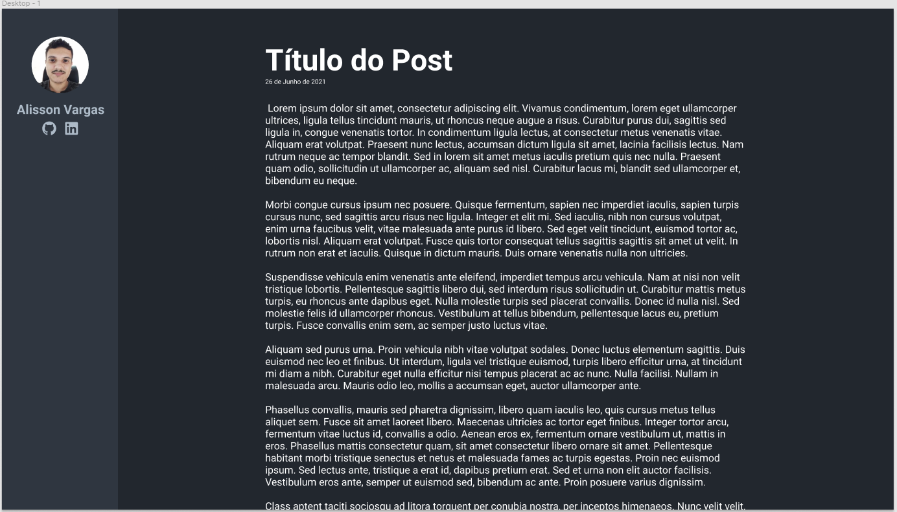

## Introdução 
Primeiramente, muito obrigado a você por estar aqui. 
Como deu para perceber este é o primeiro post, o post de lançamento do blog.

O intuito aqui será compartilhar os conhecimentos que eu for obtendo ao longo do meu percurso 
como desenvolvedor para retribuir à esta comunidade que tanto me ajudou até aqui.

## O ínicio

Desde 2019 eu tenho a vontade de começar um blog, mas enfim, após muita postergação/procrastinação comprei o domínio e comecei a escrever o blog.

 

Como inspiração para criar utilizei os seguintes sites/blogs:
- Blog do [William Justen](https://willianjusten.com.br/), onde foi que mais me inspirei.
- Blog do [Flavio Copes](https://flaviocopes.com/), utilizei para complementar um pouco do UI do site.
- E para as cores, o próprio [GitHub](https://github.com/), onde deixei bem próximo das cores utilizadas por eles, que acho muito agradável aos olhos.

## Tecnologias utilizadas

Antes de criar o blog, eu passei bastante tempo pensando se deveria utilizar uma plataforma pronta ou desenvolver a minha própria. Optei pela segunda opção, principalmente para praticar e obter o controle total sobre o blog.

 

E para isso utilizei as seguintes tecnologias para a sua criação:

 

Tecnologia                                         | Descrição
---------------------------------------------------|-----------
[Gatsby](https://www.gatsbyjs.com/)                | Framework frontend
[React](https://reactjs.org/)                      | Biblioteca JavaScript de desenvolvimento de interfaces
[Styled Components](https://styled-components.com/)| Estilização dos componentes
[MDX](https://mdxjs.com/)                          | Markdown que permite a escrita de componentes JSX

 

Deixei aqui separado o esboço do projeto, onde utilizei o [Figma](https://www.figma.com), que ficou bem parecido se notarem na imagem: 

  

## Conclusão

Enfim, esse foi um post para marcar a estreia do blog, contando os detalhes por trás e a motivação para tal. Esperem mais posts e curiosidades daqui para frente.

E não deixem de me seguir nas redes se gostarem do conteúdo e para opinar/tirar alguma dúvida, links na barra. 

