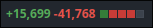
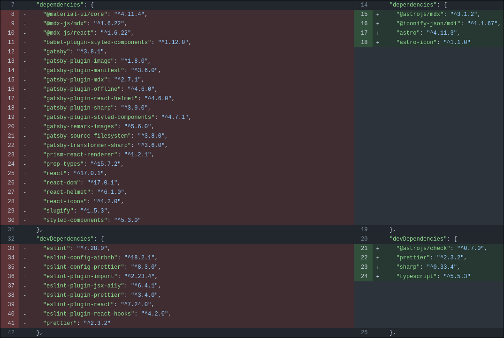

Quanto tempo, ein?
 
Quase 3 anos desde o último post. Ufa. Eu cheguei a voltar um pouco antes a mexer aqui no site mas só vim hoje contar as mudanças que fiz e porque estive afastado daqui.

Esse blog post deve ser um pouco mais leve, sem muita coisa teórica, então se quiser entrar no clima em que o escrevo, convido a dar um play em uma playlist _lo-fi_ e bora lá.

## Ausência

Antes de falar das mudanças vou contar o porque da minha ausência aqui.

Um pouco foi preguiça e procrastinação mesmo e o resto foi a tecnologia antiga do site.

 
E bom, como eu detalhei no [Primeiro Post](/blog/primeiro-post), o site foi criado utilizando o Gatsby, que na época que eu criei já estava começando a morrer.

Junto a isso, teve o fato de eu ficar 2 anos sem dar update em nenhum pacote, deixar o NodeJS em uma versão antiga...

 

Mas alguma hora iria precisar voltar né...

## Mudanças

> Dia 2 de Julho de 2024, data do meu aniversário de 29 anos.
 
Normalmente próximo ao meu aniversário eu fico mais reflexivo sobre mim, e creio que a maioria das pessoas também.

E foi nesse dia que eu resolvi voltar com o blog. Eu já estava olhando sobre o [Astro](https://astro.build/) e resolvi reconstruir o site do zero com ele.
O site diminuiu muito, tanto em código quanto nas dependências:

 
A mudança de tecnologia foi muito fácil, pois o Astro foi idealizado para ser utilizado em páginas estáticas, assim como um blog! E cada arquivo `.astro`, `.md` e `.mdx` se torna uma página no site.

Então eu basicamente removi todos os estilos que eu possuia com o styled-components e os componentes em React e reescrevi com uma simples estrutura muito parecida com o HTML, ficando muito mais fácil de dar manutenção.

 
E é isso, voltamos :)

 
Aproveitar com a postagem desse pequeno artigo para deixar o código do site público, então se quiser fuçar, fique a vontade: [https://github.com/alissonsv/alissonsv.com](https://github.com/alissonsv/alissonsv.com)

 

Até a próxima!
